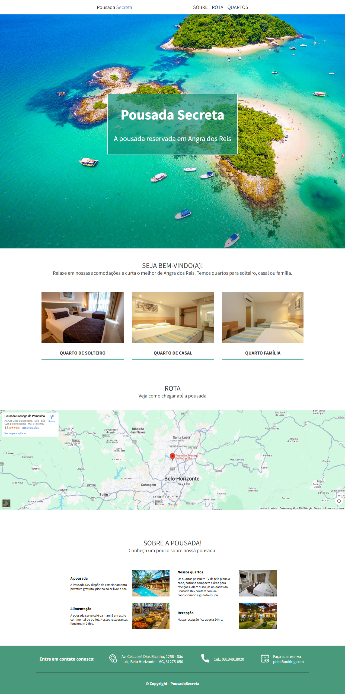
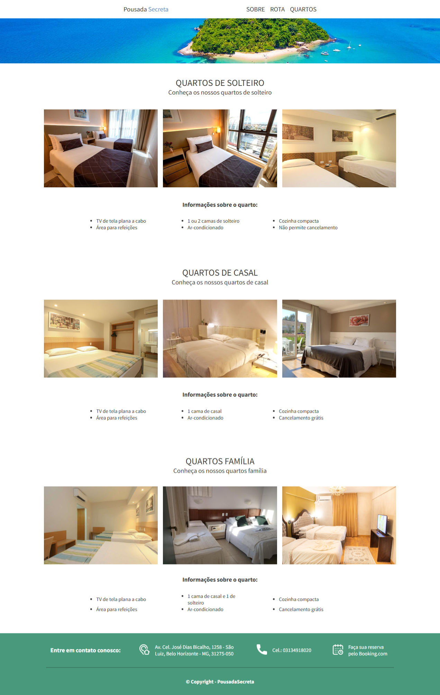

# 🏝️ Pousada Secreta – Website

Este repositório contém o código-fonte da **Pousada Secreta**, um projeto desenvolvido com HTML e CSS como prática do curso Front-end da DevMedia, composto por duas páginas principais: **Home (index.html)** e **Quartos (quartos.html)**.  
O objetivo é apresentar informações sobre a pousada, suas acomodações, formas de contato e localização.

---

## 🚀 Tecnologias utilizadas

- **HTML5** para estruturação das páginas  
- **CSS3** para estilização e layout  
- **Google Fonts (Source Sans Pro)**  
- **Google Maps** para o mapa de localização  

---

## 📄 Estrutura do projeto

### **index.html (Página inicial)**

A homepage apresenta:

- **Cabeçalho fixo** com links de navegação  
- **Banner principal** com imagem de fundo  
- Seção **Quartos** com links para tipos de acomodação  
- Seção **Rota** com mapa integrado via Google Maps  
- Seção **Sobre**, apresentando informações sobre a pousada  
- **Rodapé** com contatos e link para reservas pelo Booking.com  

O estilo desta página está definido em `css/style.css`.

---

### **quartos.html (Página de acomodações)**

Página dedicada aos tipos de quartos oferecidos:

- **Quarto de Solteiro**  
- **Quarto de Casal**  
- **Quarto Família**

Cada seção contém:

- Galeria com três imagens  
- Lista de comodidades  
- Título e descrição informativa

O layout desta página é complementado pelo arquivo `css/quartos-style.css`.

---

## 📸 Demonstração do projeto

### 🏠 Página Inicial (Home)

### 🛏️ Página de Quartos

